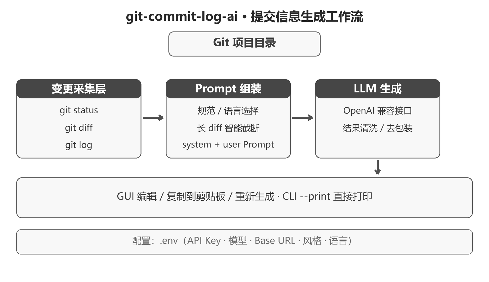
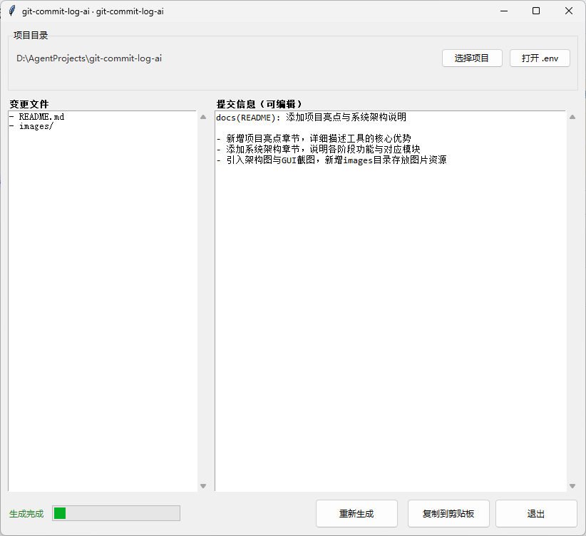

# git-commit-log-ai

面向 TortoiseGit / Git 的**提交信息 AI 助手**：在界面里选择一个 Git 项目，即可自动扫描它的全部未提交变更，调用大模型生成符合 Conventional Commits 规范的提交信息。

## 功能

- 无需监听 TortoiseGit 窗口：打开后选择任意 Git 项目，自动扫描该项目全部未提交变更（含未跟踪新文件）
- 自动分析 `git status + git diff HEAD + 近期提交历史`，生成提交信息
- 图形界面：左侧变更文件列表，右侧提交信息（**可直接编辑**），支持「复制到剪贴板」与「重新生成」
- 模型名等配置统一写在 `.env`，界面点「打开 .env」即可修改，无需每次改代码
- 兼容任何 OpenAI 兼容接口：DeepSeek、阿里百炼（通义千问）、Ollama 本地等

## 项目亮点

- **三路上下文，而不是模型裸读 diff**
    - 同时采集 `status`（变更清单）、`diff HEAD`（差异内容）和 `log`（历史风格），近期提交只作为风格参考，避免模型照抄旧内容，先理解改动目的再组织语言。
- **长 diff 智能截断，控制 token 开销**
    - 超过 `MAX_DIFF_LINES` 的差异自动截断并显式标注，大仓库也能一次稳定生成，不会把上下文撑爆。
- **规范与语言双项可配，贴近团队约定**
    - 支持 `Conventional Commits` 与 `simple` 两种风格，语言可选 `auto` / `zh` / `en`，`auto` 时按近期提交历史自动判断语言。
- **GUI + CLI 双模式交付**
    - `tkinter` 图形界面可直接编辑、复制提交信息；也支持 `--print` 命令行模式，把提交信息直接打印到终端，便于脚本集成。
- **面向 Windows 的零依赖交付**
    - 基于 `PyInstaller` 一键打包成免安装 exe，双击即用；不依赖外部窗口、不监听钩子，配置全部收敛在 `.env`。
- **人工确认，安全兜底**
    - 工具不执行提交动作，生成的信息由你人工确认后使用——避免大模型误判导致错误提交记录。

## 系统架构

项目围绕一条完整链路展开：采集 → 组装 → 生成 → 交付。

| 阶段       | 做什么                                                       | 涉及模块                              |
| ---------- | ------------------------------------------------------------ | ------------------------------------- |
| 变更采集   | 对选中的 Git 项目执行 `status` / `diff HEAD` / `log`，得到变更清单、差异内容与历史风格 | `git_collector.py` / `subprocess`     |
| 上下文组装 | 按 `COMMIT_STYLE` 与 `COMMIT_LANGUAGE` 拼装 system / user Prompt，长 diff 截断 | `prompt_builder.py` / `config.py`     |
| 模型生成   | 通过 OpenAI 兼容接口调用大模型，生成提交信息并清理多余前后缀/代码块 | `llm_client.py` / `langchain-openai`  |
| 界面交付   | 后台线程生成，`queue` 轮询回填界面；支持编辑、复制、重新生成 | `gui.py` / `tkinter` / `pyperclip`    |




## 从源码运行（开发/自用）

```powershell
py -3.10 -m venv .venv
.venv\Scripts\Activate.ps1
pip install -r requirements.txt

# 界面模式（打开后点「选择项目」选目录；也可直接传目录，作为默认选中项）
python main.py

# 指定项目目录（仍可在界面里重新选择）
python main.py D:\my-project

# 命令行模式：直接把提交信息打印到终端，不弹窗
python main.py D:\my-project --print
```

## 重新打包 exe

```powershell
.\build.bat
# 产物在 git-commit-log-ai.exe
```

## 快速开始（使用打包好的 exe）

1. 双击 `git-commit-log-ai.exe` 运行
2. 点击上方「打开.env」，填上模型名等配置
3. 点击上方「选择项目」，选一个 Git 项目根目录
4. 软件自动扫描该项目的变更并生成提交信息 → 点「复制到剪贴板」→ 在 TortoiseGit 或命令行粘贴使用

## 配置

所有配置都写在 exe 同目录的 `.env` 中（点击界面「打开 .env」即可编辑，不存在会自动创建，也会自动从 `.env.example` 复制）；配置只读取 `.env`，不读取系统环境变量：

| 变量              | 默认值                     | 说明                                   |
| ----------------- | -------------------------- | -------------------------------------- |
| `LLM_API_KEY`| 空                        | API Key（必填，如 sk-1a2b3c…）        |
| `DEEPSEEK_MODEL`  | `deepseek-chat`            | 模型名                                 |
| `LLM_BASE_URL`| `https://api.deepseek.com`| OpenAI 兼容接口地址                    |
| `COMMIT_LANGUAGE` | `zh`                       | `auto` / `zh` / `en`                   |
| `COMMIT_STYLE`    | `conventional`             | `conventional` / `simple`              |
| `MAX_DIFF_LINES`  | `600`                      | 发给模型的 diff 行数上限（超出截断）   |
| `RECENT_COMMITS`  | `5`                        | 作为风格参考的近期提交数量             |

## 目录结构

```
git-commit-log-ai/
├── main.py                 # 入口
├── config.py               # .env 加载与配置
├── git_collector.py        # git 命令收集（status + diff + log）
├── prompt_builder.py       # 提示词组装
├── llm_client.py           # 模型调用（OpenAI 兼容接口）
├── gui.py                  # 图形界面（tkinter）
├── .env.example            # 配置模板（复制为 .env 后填写）
├── requirements.txt        # Python 依赖
├── git-commit-log-ai.spec  # PyInstaller 打包配置
└── build.bat               # PyInstaller 打包脚本
```

## 说明

- 本工具不执行提交动作，生成的信息由你人工确认后使用——避免大模型误判导致错误提交记录。
- 支持任意 OpenAI 兼容接口：换模型只需在 `.env` 里改 `LLM_BASE_URL` 与 `DEEPSEEK_MODEL` 即可。